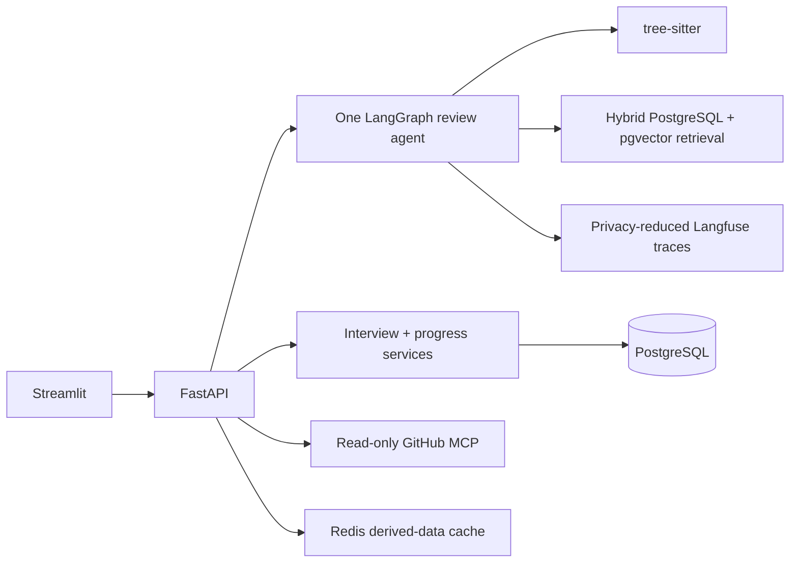

# Clutch

Clutch is a read-only AI code-review and interview-prep partner for junior
engineers. It turns pasted Python or a public/private GitHub repository or pull
request into cited findings, interviewer-style follow-ups, a stateful practice
interview, and cross-session progress evidence.



The system remains useful without credentials: no `OPENAI_API_KEY` means a
clearly labelled, deterministic `static_fallback` review. Model-backed review
uses the OpenAI Responses API with strict Pydantic output, one validation
retry, `store=False`, bounded context, and automatic safe fallback.

## What works now

- Pasted Python and bounded GitHub repo/PR review through the same typed flow.
- One six-node LangGraph workflow: parse, static review, retrieve, synthesize,
  validate, and generate questions.
- In-memory zero-service mode or durable PostgreSQL/pgvector mode.
- Stateful interview turns, a structured final feedback report, and progress
  aggregation across review sessions.
- Redis caches only hashed embedding/retrieval inputs and knowledge-base data;
  raw source and review evidence are excluded.
- Explicit Langfuse spans contain hashes, categories, citation IDs, timings,
  model/fallback metadata, and token counts—not raw code, prompts, or answers.
- CI gates Ruff, mypy, tests, deterministic evals, prompt-injection behavior,
  secret scanning, dependency audit, three container builds, and Terraform.
- Non-root Docker images and a validated AWS ECS/RDS/ElastiCache Terraform
  module. No cloud resources have been applied.
- Optional constant-time API-key authentication protects every non-health route.
  OpenAI completion and embedding calls reserve against per-call and UTC-daily
  spend ceilings before any provider request; Redis shares the daily counter.

## Local development

```bash
python3 -m venv .venv
. .venv/bin/activate
python -m pip install -e ".[dev]"
uvicorn backend.app.main:app --reload
```

In another terminal:

```bash
. .venv/bin/activate
streamlit run frontend/app.py
```

Open `http://localhost:8501`. The default requires no database, Redis, GitHub
token, Langfuse account, or model key.

Copy `.env.example` to `.env` to opt into provider-backed behavior. Important
variables are:

- `OPENAI_API_KEY`, `OPENAI_MODEL`, `OPENAI_EMBEDDING_MODEL`
- `CLUTCH_MODEL_PER_REQUEST_USD`, `CLUTCH_MODEL_DAILY_USD`; custom models also
  require explicit per-million-token price variables
- `CLUTCH_REQUIRE_AUTH`, `CLUTCH_API_KEY` (both backend and Streamlit receive
  the same server-side key in a deployed environment)
- `DATABASE_URL` (or the separate `CLUTCH_DB_*` values used by ECS)
- `REDIS_URL`
- `GITHUB_TOKEN`, `GITHUB_MCP_URL`
- `LANGFUSE_*`; tracing is off unless explicitly enabled with both keys

## Full local stack

```bash
export CLUTCH_DB_PASSWORD=replace-with-a-local-only-password
docker compose build
docker compose up -d postgres redis github-mcp
docker compose run --rm backend alembic upgrade head
docker compose up -d backend frontend
```

The UI is at `http://localhost:8501`, FastAPI at `http://localhost:8000`, and
the MCP Streamable HTTP endpoint at `http://localhost:8001/mcp`. Run migrations
as a one-off command; do not run them independently in every backend replica.

## API surface

| Endpoint | Purpose |
|---|---|
| `GET /health` | Backend health |
| `GET /runtime/cache` | Safe aggregate cache metrics |
| `GET /runtime/spend` | Safe UTC-day model-spend reservations and ceilings |
| `POST /review` | Pasted-code review |
| `POST /review/github` | Repo or PR review through MCP |
| `POST /interview/turn` | Start or continue an interview |
| `GET /interview/{session_id}/feedback` | Final report for a completed interview |
| `GET /progress/{profile_id}` | Aggregate durable progress |
| `POST /progress/{profile_id}/snapshots` | Save a progress snapshot |

OpenAPI documents the exact Pydantic request and response shapes at `/docs`.

## Verification and evals

```bash
python scripts/run_quality_checks.py
python scripts/run_security_checks.py
```

The quality command runs Ruff, mypy, pytest, and the zero-cost eval gate. The
security command runs `detect-secrets` and `pip-audit` and therefore needs
network access for current advisory data.

Dataset `2026-09-08.v5` has 15 review cases: 12 pasted-code cases and three
multi-file repositories run through the real GitHub review coordinator. It also
has three adversarial prompt-injection samples and three complete
interview-to-feedback cases. Its deterministic baseline is deliberately narrow:

| Metric | Baseline |
|---|---:|
| Finding precision / recall | 1.000 / 1.000 |
| Finding severity accuracy | 1.000 |
| Clean-negative / mixed full-recall rate | 1.000 / 1.000 |
| Retrieval Precision@3 / Recall@3 | 0.786 / 0.559 |
| Retrieval MRR / nDCG@3 | 1.000 / 0.934 |
| Retrieval judgment coverage@3 | 1.000 |
| Irrelevant-result rate@3 | 0.044 |
| Citation faithfulness | 1.000 |
| Hallucinated-line rate | 0.000 |
| Question relevance | 1.000 |
| GitHub ingestion / persisted-source privacy | 1.000 / 1.000 |
| Interview score / completion accuracy | 1.000 / 1.000 |
| Feedback expectation / answer-privacy pass rate | 1.000 / 1.000 |
| Prompt-injection pass rate | 1.000 |
| Model cost | $0.00 |

The perfect scores prove only the named deterministic rules, not general code
review quality. Live-model accuracy, structured-output failures, latency, and
cost remain unmeasured until an API key is provided.

A local container smoke test on 2026-09-08 measured the same synthetic review
at about 111 ms cold and 8.6 ms after a Redis retrieval-cache hit. That is a
single correctness smoke test, not a production benchmark.

## Trust and privacy model

- Submitted code, comments, README content, diffs, and patches are untrusted
  data and never instructions.
- The v1 GitHub MCP exposes exactly `list_repo_files`, `fetch_repo`, and
  `fetch_pr_diff`; every tool is read-only and bounded.
- Raw source and finding evidence are not persisted. PostgreSQL receives the
  source SHA-256, line count, derived findings/questions, and operational
  metadata. Interview answers are reduced to a hash and signal summary.
- Langfuse receives explicit privacy-reduced observations and has automatic IO
  capture disabled. Redis keys contain hashes rather than source text.
- Clutch cannot comment, commit, merge, or otherwise mutate a repository.

See [SECURITY_CHECKLIST.md](SECURITY_CHECKLIST.md) for the release gate and
[EVALUATION_AND_GOVERNANCE.md](EVALUATION_AND_GOVERNANCE.md) for metric policy.

## AWS path

The validated, unapplied root module is in `infra/terraform`. It models an AWS
Budget, ECR, ECS/Fargate, an ALB, Cloud Map, private RDS PostgreSQL with
pgvector support, private TLS ElastiCache Redis, CloudWatch, managed secrets,
and least-privilege security groups.

Read [infra/terraform/README.md](infra/terraform/README.md) and [CLOUD.md](CLOUD.md)
before doing anything with AWS. `service_desired_count` defaults to zero, but
RDS, ElastiCache, and the ALB still cost money. Applying the module is an
explicit user checkpoint requiring account, region, budget, ingress, and
teardown approval.

## Known limitations

- Python is the only parsed language; GitHub review selects Python files.
- The validated knowledge corpus has 100 cited references, rubrics, and
  question-bank items with role/seniority metadata, reaching Phase 2's lower
  bound. The deterministic eval remains synthetic despite adding multi-file,
  clean, and mixed-signal cases.
- Interview assessment is deterministic and does not yet adaptively generate
  novel follow-ups; the final report is deterministic and evidence-based rather
  than a claim of general interview readiness.
- API-key auth is intentionally deployment-level rather than user accounts.
  Account identity, key rotation automation, and abuse-rate limiting remain.
- Live OpenAI, Langfuse, private-GitHub, and AWS evidence requires user-owned
  credentials. No secrets belong in this repository.
